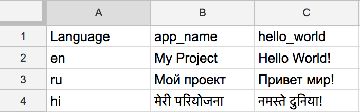

# translation-copier

A tool to copy string translations in an Android project from a CSV

## How to install?

You need to have Node.js installed on your system before you can use this package. Get it here: [Node.js](https://nodejs.org/)

Once you have Node.js and NPM setup, you can run:

    sudo npm install -g translation-copier

Or the following in your admin command prompt on Windows:

    npm install -g translation-copier

## How to use?

Make a CSV of strings in the following format:

Let translation copier take control!

    translation-copier ./translated-strings.csv ~/Workspace/MyProject/app/src/main/res

It will copy all the translations to their respective strings.xml files and update the older values if they exist already.
